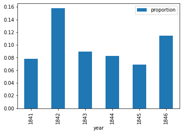
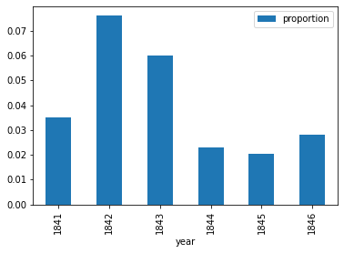
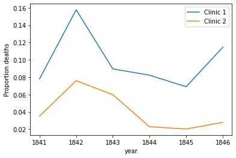
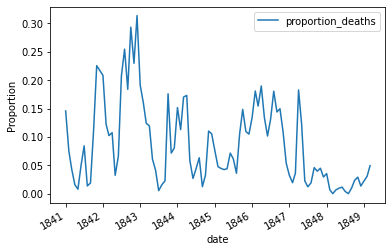
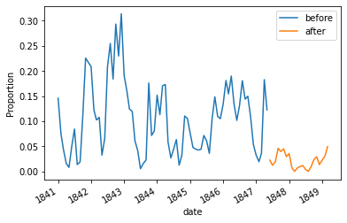

```python
import pandas as pd 
yearly=pd.read_csv('/Users/yifeisun/Desktop/yearly_deaths_by_clinic.csv')
print(yearly)
print(yearly.shape)
```

        year  births  deaths    clinic
    0   1841    3036     237  clinic 1
    1   1842    3287     518  clinic 1
    2   1843    3060     274  clinic 1
    3   1844    3157     260  clinic 1
    4   1845    3492     241  clinic 1
    5   1846    4010     459  clinic 1
    6   1841    2442      86  clinic 2
    7   1842    2659     202  clinic 2
    8   1843    2739     164  clinic 2
    9   1844    2956      68  clinic 2
    10  1845    3241      66  clinic 2
    11  1846    3754     105  clinic 2
    (12, 4)


```python
#calculate proportion of deaths per no.births
yearly['proportion']=yearly['deaths']/yearly['births']
#divide into two clinics 1st is clinic_1 2nd is clinic_2
clinic_1=yearly[yearly['clinic']=='clinic 1']
clinic_2=yearly[yearly['clinic']=='clinic 2']
#print out both
print(clinic_1)
print(clinic_2)
clinic1_proportion=clinic_1['deaths']/clinic_1['births']
clinic2_proportion=clinic_2['deaths']/clinic_2['births']
ax1=clinic_1.plot(x='year',y='proportion',kind='bar')
clinic_2.plot(x='year',y='proportion',kind='bar')
print(ax)
print(clinic1_proportion)
```

       year  births  deaths    clinic  proportion
    0  1841    3036     237  clinic 1    0.078063
    1  1842    3287     518  clinic 1    0.157591
    2  1843    3060     274  clinic 1    0.089542
    3  1844    3157     260  clinic 1    0.082357
    4  1845    3492     241  clinic 1    0.069015
    5  1846    4010     459  clinic 1    0.114464
        year  births  deaths    clinic  proportion
    6   1841    2442      86  clinic 2    0.035217
    7   1842    2659     202  clinic 2    0.075968
    8   1843    2739     164  clinic 2    0.059876
    9   1844    2956      68  clinic 2    0.023004
    10  1845    3241      66  clinic 2    0.020364
    11  1846    3754     105  clinic 2    0.027970
    AxesSubplot(0.125,0.2;0.775x0.68)
    0    0.078063
    1    0.157591
    2    0.089542
    3    0.082357
    4    0.069015
    5    0.114464
    dtype: float64


    

    


    

    


```python
%matplotlib inline
ax=clinic_1.plot(x='year',y='proportion',label="Clinic 1")
clinic_2.plot(x='year',y='proportion',label="Clinic 2",ax=ax,ylabel='Proportion deaths')
```


    <AxesSubplot:xlabel='year', ylabel='Proportion deaths'>


    

    


```python
monthly=pd.read_csv("/Users/yifeisun/Desktop/monthly_deaths.csv",parse_dates=['date'])
monthly['proportion_deaths']=monthly['deaths']/monthly['births']
monthly.head()
ax=monthly.plot(x='date',y='proportion_deaths',ylabel='Proportion')
```


    

    


```python
#Date when handwashing was made mandatory
handwashing_start=pd.to_datetime('1847-06-01')
#split montly into before and after
before_handwashing=monthly[monthly['date']<handwashing_start]
after_handwashing=monthly[monthly['date']>=handwashing_start]

#Make another plot
ax=before_handwashing.plot(x='date',y='proportion_deaths',label='before')
after_handwashing.plot(x='date',y='proportion_deaths',label='after',ax=ax,ylabel='Proportion')
```


    <AxesSubplot:xlabel='date', ylabel='Proportion'>


    

    


```python
before_proportion=before_handwashing['proportion_deaths']
after_proportion=after_handwashing['proportion_deaths']
mean_diff=after_proportion.mean()-before_proportion.mean()
mean_diff
```


    -0.08395660751183336


```python
boot_mean_diff=[]
for i in range(3000):
    boot_before=before_proportion.sample(frac=1,replace=True)
    boot_after=after_proportion.sample(frac=1,replace=True)
    boot_mean_diff.append(boot_before.mean()-boot_after.mean())
confidence_interval=pd.Series(boot_mean_diff).quantile([0.02,0.95])
confidence_interval
```


    0.02    0.065978
    0.95    0.098579
    dtype: float64


```python
print("Conclusion is : Doctors should wash their hands")
```

    Conclusion is : Doctors should wash their hands


```python

```
